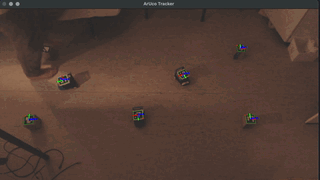

# Swarm Light-Seeking PSO with ESP8266 & ArUco

This project implements a **Particle Swarm Optimization (PSO)** algorithm using a swarm of robots equipped with **ESP8266** microcontrollers. Developed as part of the *Swarm Sensor Practical Course* at **Georg-August-University Göttingen**, the goal is to have the robots collaboratively find the strongest light source in a 2D plane.


## 💡 Project Concept
The core of the project is the translation of the mathematical PSO algorithm into a physical environment:
* **The Problem:** Robots need to find the global optimum (the brightest light) without knowing the full map.
* **The Solution:** Using ArUco markers and a top-down camera to replace expensive DWM3000 positioning sensors, providing a cost-effective real-time GPS-like system for the swarm.

### The Algorithm
The movement of each robot (particle) is governed by:
1.  Its current velocity.
2.  Its personal best position found so far ($p_{best}$).
3.  The global best position found by the entire swarm ($g_{best}$).

$$v_{i}(t+1) = w v_{i}(t) + c_1 r_1 (p_{best,i} - x_{i}(t)) + c_2 r_2 (g_{best} - x_{i}(t))$$

---

## 🛠 Hardware & Requirements
* **Microcontrollers:** ESP8266 (NodeMCU/Wemos D1 Mini).
* **Sensors:** Light sensors (LDR/Phototransistors).
* **Positioning:** Webcam + ArUco markers.
* **Communication:** ESP-NOW (Low latency Master-Slave protocol).
* **Software:** Python 3.10.16 & Arduino IDE.
* **3D Printing:** For custom robot chassis and sensor mounts. (I provide the chasis design files in the `3D_models` folder, but you can also design your own!)
---

## 🚀 Getting Started

### 1. Python Environment
I recommend using **Conda** to manage dependencies:
```bash
conda create -n swarm_pso python=3.10.16
conda activate swarm_pso
pip install -r requirements.txt
```

Before running the swarm, you must calibrate your specific camera to avoid lens distortion:
1. Navigate to the `calibrate/` folder.
2. Use the provided scripts to generate your `calibration.yml` file.
3. Print and attach the ArUco markers to your robots.
### 3. Uploading the Code to ESP8266
The robots communicate via a Master-Slave architecture.
#### Emmiter (Master):
1. Upload the emitter code via Arduino IDE.
2. Open the Serial Monitor to find the MAC Address (e.g., MAC: 18:FE:AA:AA:AA:AA).
#### Receiver (Slaves):
1. Update the `receiver.ino` code with the Master's MAC Address.
```cpp
uint8_t emisorAddress[] = {0x18, 0xFE, 0xAA, 0xAA, 0xAA, 0xAA};
```
2. Assign a unique ID to each robot:
```cpp
#define ROBOT_ID 1 // Change this for each robot (1, 2, 3...)
```
<!-- separation line -->


### 4. Running the PSO Algorithm
To start the tracking system and the PSO controller, run:
```bash
python PSO.py
```
This will initialize the camera, start tracking the robots, and execute the PSO algorithm to guide them towards the light source.
- **Stop**: Press Ctrl + C to safely stop all robots and close the system.
## Demo



## Acknowledgments
* **Georg-August-University Göttingen - Swarm Sensor Practical Course.** - Swarm Sensor Practical Course.
* Special thanks to **Dr. Michale Bidollahkhani**for his guidance and support throughout the project.


